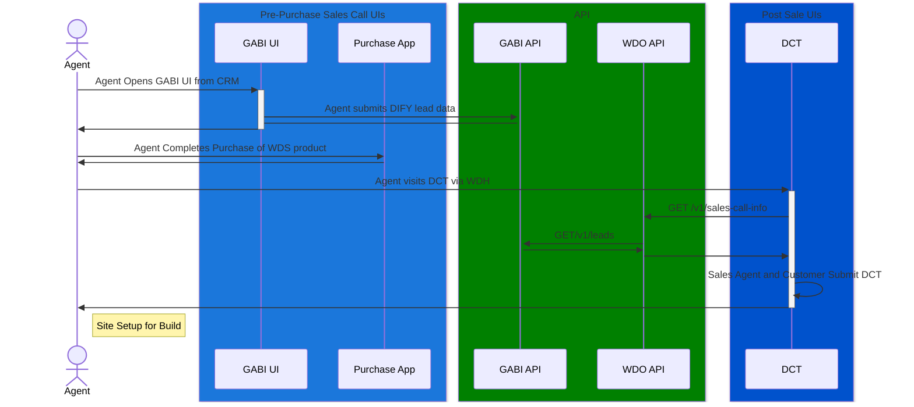

```mermaid
sequenceDiagram
    actor Agent
    box rgb(27, 119, 219) Pre-Purchase Sales Call UIs
        participant GABI UI
        participant Purchase App
    end
    box green API
        participant GABI API
        participant WDO API
    end
    box rgb(0, 82, 204) Post Sale UIs
        participant DCT
    end
    Agent ->>+ GABI UI: Agent Opens GABI UI from CRM
    GABI UI ->>+ GABI API: Agent submits DIFY lead data
    GABI API->GABI UI:  
    GABI UI->>-Agent: 
    Agent->>Purchase App: Agent Completes Purchase of WDS product
    Purchase App->>Agent: 
    Agent->>+DCT: Agent visits DCT via WDH
    DCT->>WDO API: GET /v1/sales-call-info
    WDO API->>GABI API: GET/v1/leads
    GABI API->>WDO API: 
    WDO API->>DCT: 
    DCT->>DCT: Sales Agent and Customer Submit DCT
    DCT->>-Agent: 
    note right of Agent: Site Setup for Build
```
