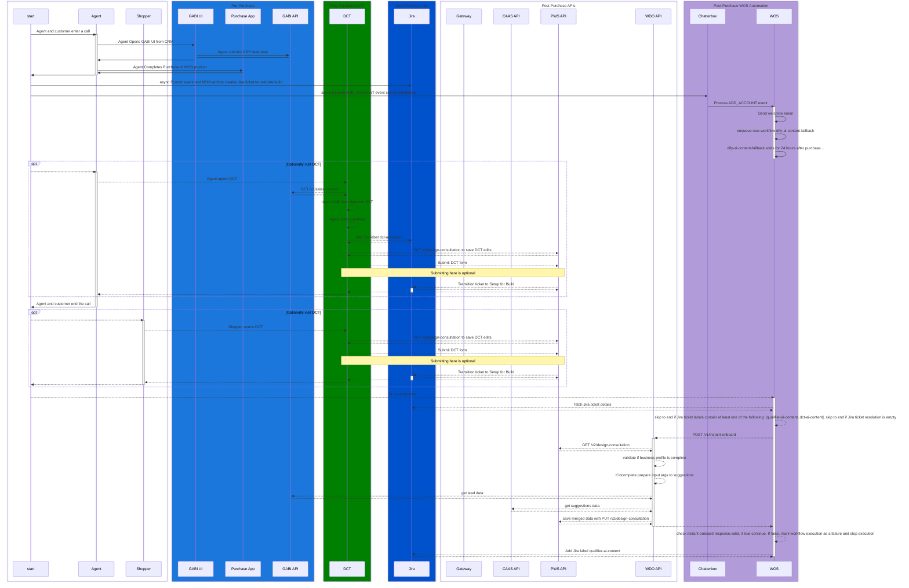

```mermaid
sequenceDiagram
    box
        participant start
        participant Agent
        participant Shopper
    end
    box rgb(27, 119, 219) Pre-Purchase
        participant GABI UI
        participant Purchase App
        participant GABI API
    end
    box green Post-Purchase DCT
        participant DCT
    end
    box rgb(0, 82, 204) Post-Purchase Jira
        participant Jira
        end
    box Post-Purchase APIs
        participant Gateway
        participant CAAS API
        participant PWS API
        participant WDO API
    end
    box rgb(177, 156, 217) Post-Purchase WOS Automation
        participant Chatterbox
        participant WOS
    end
    
    start->>Agent: Agent and customer enter a call
    activate Agent
    Agent ->>+ GABI UI: Agent Opens GABI UI from CRM
    GABI UI ->>+ GABI API: Agent submits DIFY lead data
    GABI API->GABI UI:  
    GABI UI->>Agent: 
    Agent->>Purchase App: Agent Completes Purchase of WDS product
    Purchase App->>Agent: 
    Agent->>start: 
    deactivate Agent
    start->>Jira: async Ecomm event and MSH lambda creates Jira ticket for website build
    start->>Chatterbox: async Ecomm ADD_ACCOUNT event sent to Chatterbox
    Chatterbox->>WOS: Process ADD_ACCOUNT event
    activate WOS
    WOS->>WOS: Send welcome email
    WOS->>WOS: enqueue new workflow dify-ai-content-fallback
    WOS->>WOS: dify-ai-content-fallback waits for 24 hours after purchase...
    deactivate WOS
    opt Optionally visit DCT
    start-->>Agent: 
    activate Agent
    Agent-->>DCT: Agent opens DCT
    DCT-->>GABI API: GET /v1/sales-call-info
    GABI API-->>DCT: 
    DCT-->>DCT: inject GABI lead data into DCT
    DCT-->>DCT: Agent clicks continue
    DCT-->>Jira: Add Jira label dct-ai-content
    Jira-->>DCT: 
    DCT-->>PWS API: PUT /v3/design-consultation to save DCT edits 
    PWS API-->>DCT: 
    DCT-->>PWS API: Submit DCT form
    note over DCT,PWS API: Submitting here is optional
    PWS API-->>+Jira: Transition ticket to Setup for Build
    Jira-->>-PWS API: 
    PWS API-->>DCT: 
    DCT-->>Agent: 
    end
    Agent->>start: Agent and customer end the call
    deactivate Agent
    opt Optionally visit DCT
    start-->>Shopper: 
    activate Shopper
    Shopper-->>DCT: Shopper opens DCT
    DCT-->>PWS API: PUT /v3/design-consultation to save DCT edits
    PWS API-->>DCT: 
    DCT-->>PWS API: Submit DCT form
    note over DCT,PWS API: Submitting here is optional
    PWS API-->>+Jira: Transition ticket to Setup for Build
    Jira-->>-PWS API: 
    PWS API-->>DCT:  
    DCT-->>Shopper: 
    Shopper-->>start: 
    deactivate Shopper 
    end
    start-->>WOS: 24 hours passes
    activate WOS
    WOS-->>Jira: fetch Jira ticket details
    Jira-->>WOS:  
    WOS-->>WOS: skip to end if Jira ticket labels contain at least one of the following: [qualifier-ai-content, dct-ai-content], skip to end if Jira ticket resolution is empty
    WOS-->>+WDO API: POST /v1/instant-onboard
    WDO API-->>PWS API: GET /v2/design-consultation
    PWS API-->>WDO API: 
    WDO API-->>WDO API: validate if business profile is complete
    WDO API-->>WDO API: if incomplete prepare input args to suggestions
    WDO API-->>GABI API: get lead data
    GABI API-->>WDO API: 
    WDO API-->>CAAS API: get suggestions data
    CAAS API-->>WDO API: 
    WDO API-->>PWS API: save merged data with PUT /v2/design-consultation
    PWS API-->>WDO API: 
    WDO API-->>-WOS: 
    WOS-->>WOS: check instant-onboard response.valid, if true continue. If false, mark workflow execution as a failure and stop execution
    WOS-->>Jira: Add Jira label qualifier-ai-content
    Jira-->>WOS: 
    deactivate WOS
```
